# CITELY.AI

Citely.ai is a SaaS platform designed to enhance the research process for students and researchers by utilizing the capabilities of advanced Large Language Models like ChatGPT. We aim to streamline the management of extensive research data, facilitating easier comprehension, organization, and discovery of new scientific knowledge.

This initiative was launched after being selected for the [EGG Incubator](https://www.theegg.gr/en/) program by EuroBank in Greece. The development team consisted of two members; I took on the role of lead developer, overseeing the UI/UX design, Architecture Design, Frontend, and Backend development. My colleague focused on the Natural Language Processing (NLP) components (LLM Agents). Although Citely.ai did not advance to the final stage of the incubation program, it provided a valuable opportunity for professional growth and collaboration with a talented team.

Here is an overview of the platform, highlighting the implemented features and the technologies employed in its development.

## Tech Stack

* Vue3 / TailwindCSS / Vite (for the Web App interface)
* Supabase for the database, storage and user authentication
* Python / FastAPI / LangChain / Vector Database (for the NLP part of the platform)
* APIs used: OpenAI ChatGPT/Embeddings, Mathpix, Semantic Scholar, Stripe (for payment processing)

## Features

* **User Authentication**: Users can sign up and login to the platform using their email and password. The platform also supports social login using Google and Github.
* **Workspace**: Users can see their recent activity, saved articles, and other relevant information on their dashboard.
* **Article Search**: Users can search for articles using the Semantic Scholar API and save them to their workspace.
* **Chat Interface**: Users can interact with the LLM model using the ChatGPT-like interface to ask questions and get answers based on the articles they have saved. The chat interface supports live rendering of LaTex, Chemical Equations, and other scientific notations by extending Markdown to support these features.
* **Payment Processing**: Users can subscribe to a monthly plan to access premium features of the platform using the Stripe API.

The basic idea behind the platform is to provide a an all in one solution for researchers to query all the academic articles they have saved in their workspace and get answers to their questions in a conversational manner. In the background the platform transforms the PDF into LaTex, uses the LangChain API to generate embeddings for the articles and the ChatGPT API to generate answers to the user's questions. With the power the LLM Agents architecture, we can provide a more conversational and human-like experience to researchers and students.

## The Platform

### Login Page

The login page is the first page users see when they visit the Web App. Users can sign up or login using their email and password. The platform also supports social login using Google and Github.

<!-- image -->
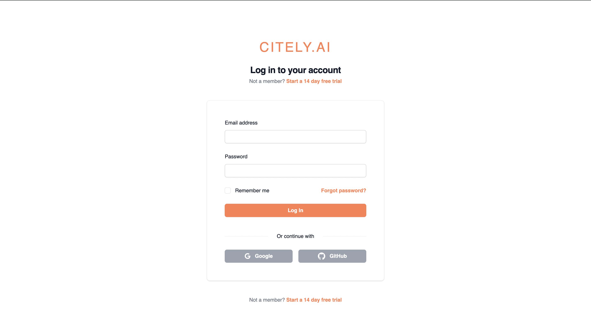

### Main Page

The main page is where users can manage and create Workspaces where in they can save articles, search for new articles, and interact with the Chat Interface.

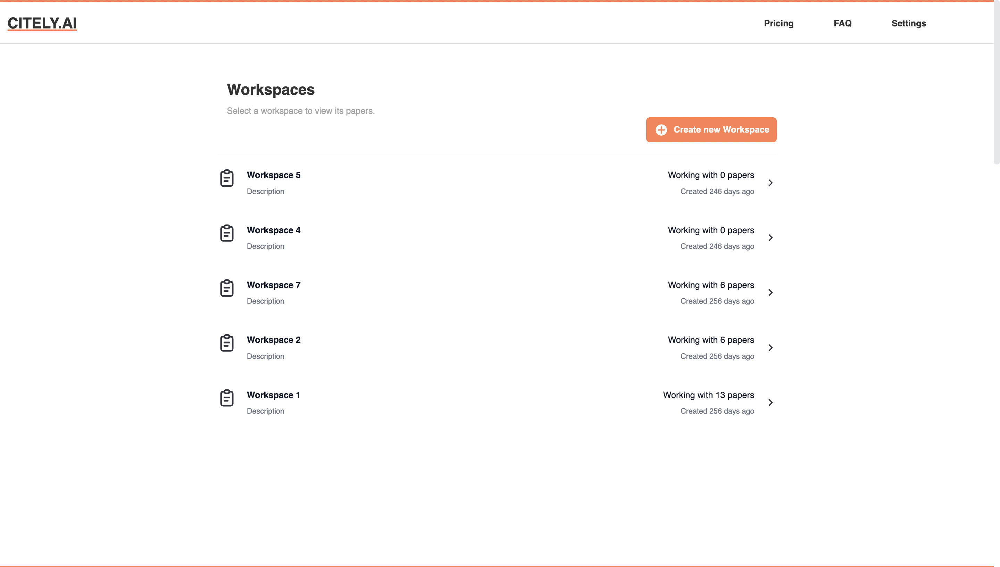

### Workspace

The Workspace is where users can see their recent activity, saved articles, and other relevant information on their dashboard.

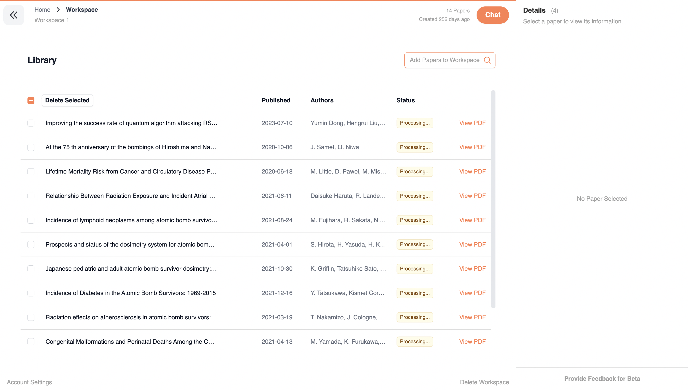

### Article Search

Users can search for articles using the Semantic Scholar API and save them to their workspace in one click.

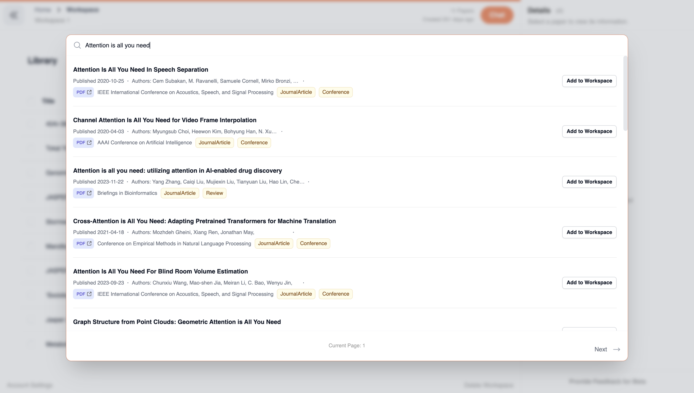

### PDF Viewer

Users can view the PDF of the articles they have saved in their workspace. They can also explore relevant papers through the references column on the right.

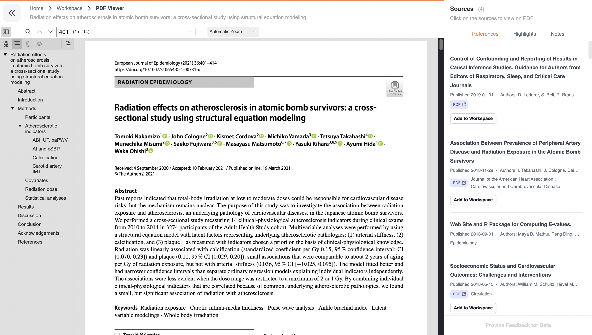

### Chat Interface

This is the most important feature of the platform. Users can interact with their imported articles using the ChatGPT-like interface to ask questions and get answers based on the articles they have saved.

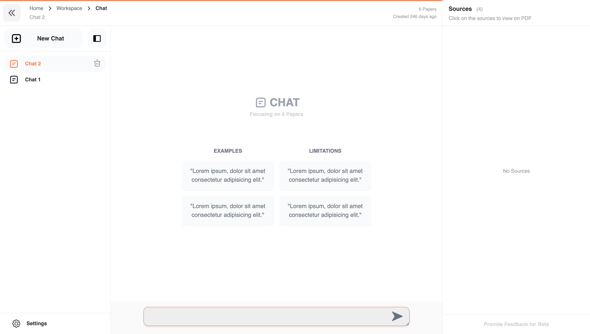

The chat interface supports live rendering of LaTex, Chemical Equations, and other scientific notations. This was the most interesting part of the project as it required a lot of work to get the rendering right and support Adaptable UI functionalities extending the functionalities of the ChatGPT interface

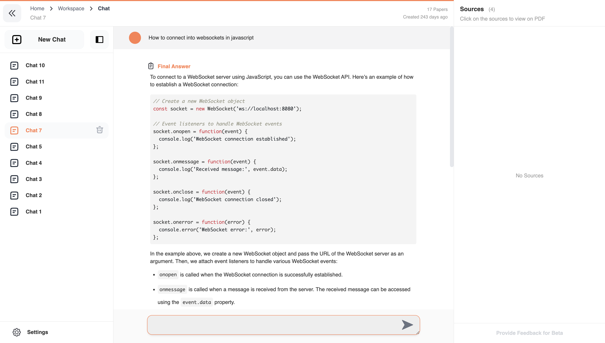

The platform supports rendering of Chemical Equations.

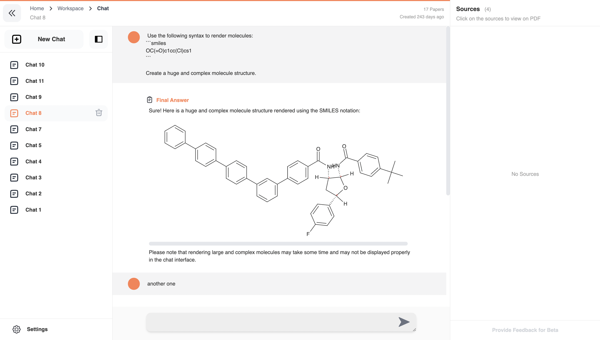

The platform also supports rendering of LaTex equations.

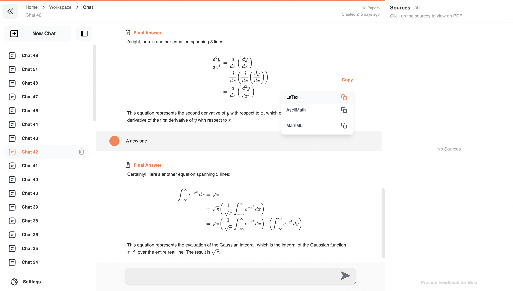

### Settings

Users can manage their account settings, subscription plans, and other relevant information in the settings page.

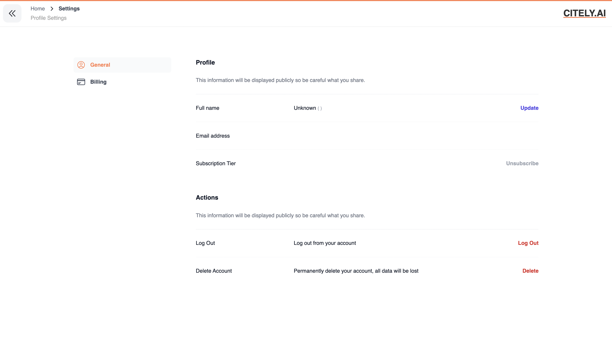

### Payment Processing

Users can subscribe to a monthly plan to access premium features of the platform using the Stripe API.

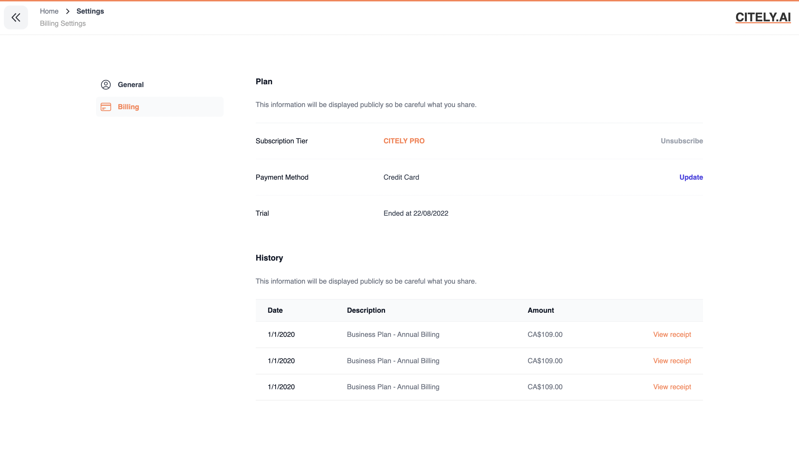

## Conclusion

Working on Citely.ai was an enriching experience that deepened my understanding of Large Language Models, including their potential and limitations. Developing the platform from the ground up allowed me to acquire substantial expertise in full-stack application development and API integration.

The JavaScript engineering elements, such as creating the chat interface and integrating a PDF viewer, posed significant challenges but were also the most engaging parts of the project. I delved into various libraries and tools to construct these features from scratch.

The citely.ai landing page was also developed by me using NextJS and TailwindCSS. The landing page is hosted on Namecheap and can be accessed [here](citely.ai).

The experience of working on a real-world project with a clear goal and timeline was invaluable for my professional growth.

The development of the platform is ongoing, with numerous possibilities for adding features that could further enhance its utility for researchers and students. The LLM pipeline is not included in this codebase as it is closed source as of now.