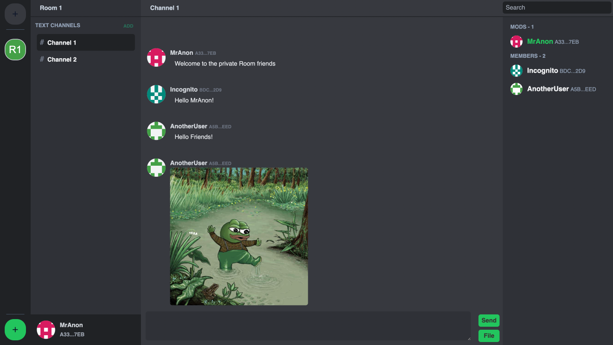
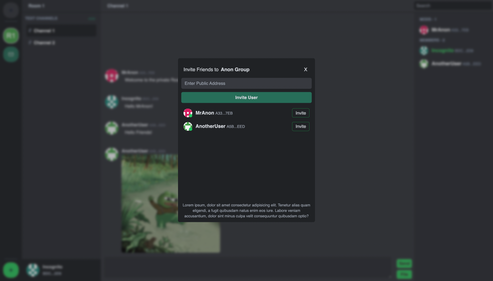

# End-to-End Encrypted Discord: A Secure Messaging Platform.

## Introduction

In today's digital world, the need for secure communication is more critical than ever, particularly as we increasingly rely on online platforms. This thesis explores a study focused on developing a secure communication platform supporting similar characteristics to Discord but with enhanced security features akin to those in Signal. A key aim is to incorporate the ability to access historical messages securely, a feature often missing in many end-to-end encryption (E2EE) applications.

## Current Cryptographic Solutions

End-to-end encryption is essential for keeping private conversations secure online. Signal has been a leader in this field, using advanced cryptographic protocols to ensure messages are kept confidential and authentic from sender to receiver. However, Signal and similar apps do not allow new group members to view past messages, a feature that could improve user experience and accessibility in a lot of cases.

## Proposed End-to-End Encrypted Discord Model

The envisioned platform combines Discord's user-friendly interface with robust security measures. This system aims to balance security with practicality, ensuring messages are both secure and accessible when needed. The main challenge is balancing ease of use with tight security, especially when it comes to accessing past communications securely. Additionally, the platform must handle synchronization issues effectively to keep all group members updated.

## Development of the "E2EE Discord" Proof of Concept

A proof of concept was developed to test these ideas using a modern tech stack. The frontend was built with Vue 3 and styled with TailwindCSS, while the backend used Supabase for database interactions. Extensive use of TypeScript ensured that complex cryptographic processes were implemented accurately and securely, focusing on client-side encryption to maintain the integrity of data.

## Conclusion

The development of the "E2EE Discord" proof of concept represents a significant step forward in demonstrating how advanced encryption techniques can be integrated into widely used communication platforms while maintaining a high standard of user experience and security. This implementation could serve as a benchmark for future developments in the realm of secure digital communications. The successful deployment of this proof of concept highlights the potential for broader adoption of E2EE technologies, paving the way for more secure, private, and reliable online interactions.

For a more detailed explanation of the project, please refer to the [Master Thesis](). (Original Greek version)

Or the [English Translation](). (Automatically Translated - Contains errors)

## The Platform

The app supports the following features:

- **End-to-End Encryption**: All messages are encrypted on the client-side before being sent to the server, ensuring that only the intended recipients can read them.
- **Invitation System**: Users can invite others to join their group, allowing new members to access past messages securely. The invitation message is encrypted with asymmetric cryptography to ensure confidentiality.
- **Message History**: Group members can access past messages securely, even if they join the group after the messages were sent.
- **The server does not have access to the messages**: The server only stores encrypted messages, ensuring that user data remains confidential.
- **Metadata** like group members are stored encrypted on the server, ensuring that even this information is kept private.
- **Real-time Updates**: The app uses WebSockets to provide real-time updates, ensuring that all group members are kept up to date with the latest messages and state changes.

## User Interface

## Invitation

