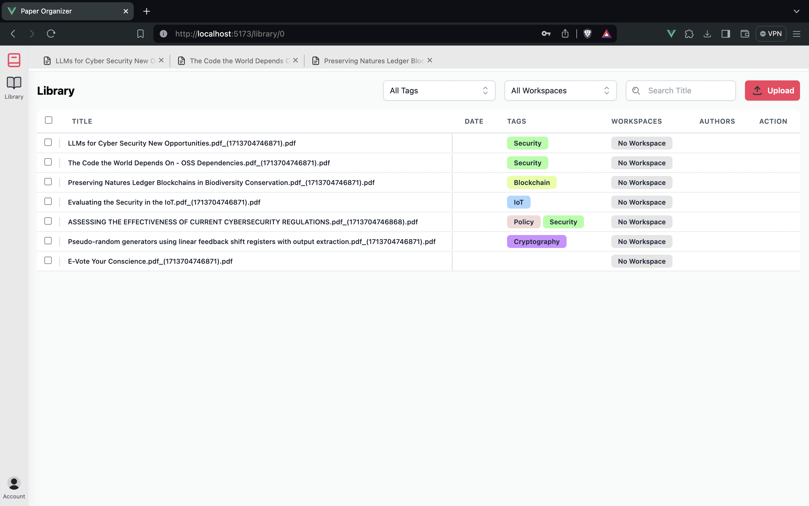
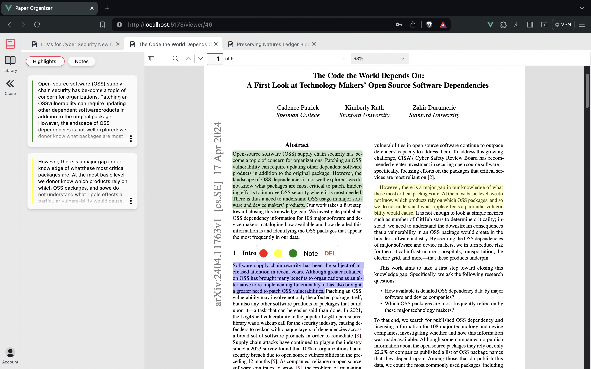

# Paper-Organizer

Paper-Organizer is a web application designed to streamline the management and organization of PDF documents. Built with Vue3, TypeScript, TailwindCSS and Supabase this tool allows users to upload and manage their PDF files efficiently and enhances the reading experience with features like tagging, tabbed browsing, and document highlighting.

## Features
- **PDF Upload:** Securely upload and store PDF documents directly in the web application.
- **Tagging System:** Organize documents by assigning custom tags.
- **Tabbed Browsing:** Similar to a web browser, manage multiple PDFs in tabs for easy navigation and comparison.
- **PDF Highlighter:** Utilize an custom integrated PDF highlighter that enables marking important text directly on the PDF documents.

## Libraries
- **PDF.js:** A robust library by Mozilla used to render PDF documents in the browser. It serves as the core technology for displaying the content of uploaded PDFs.
- **Web Highlighter (https://github.com/alienzhou/web-highlighter):** Customised to add text highlighting capabilities within the PDF viewer. This library allows users to highlight and annotate text on static web pages.

## Challenges in PDF Highlighting
Implementing a web-based highlighter on a rendered PDF document presented unique challenges:
1. **Text Layer Integration:** PDF.js renders text in a separate layer from the image layer. Synchronizing the highlighter library with this text layer to enable accurate selections and annotations was critical.
2. **Custom Highlighting:** The highlighter needed to be customized to work with PDF.js and provide a seamless user experience for highlighting text in PDF documents. Normally highlighters are designed for static web pages, addapting it to work for PDFs that render text dynamically in a moving window was a significant challenge.
3. **Scalability:** As PDF documents can vary significantly in size and complexity, ensuring the highlighter performed efficiently across diverse documents was essential.
4. **Rendering Accuracy:** Maintaining text integrity and formatting during the highlighting process required careful manipulation of DOM elements generated by PDF.js.
5. **Pop-up menu:** Implementing a user-friendly interface for adding and managing highlights was a key feature for enhancing the reading experience. Integrating this functionality seamlessly within the PDF Viewer was a significant challenge.

## Getting Started
To get started with Paper-Organiser, follow these steps:

### Prerequisites
- Node.js installed on your machine
- Familiarity with Vue.js and TypeScript

## Screenshots

