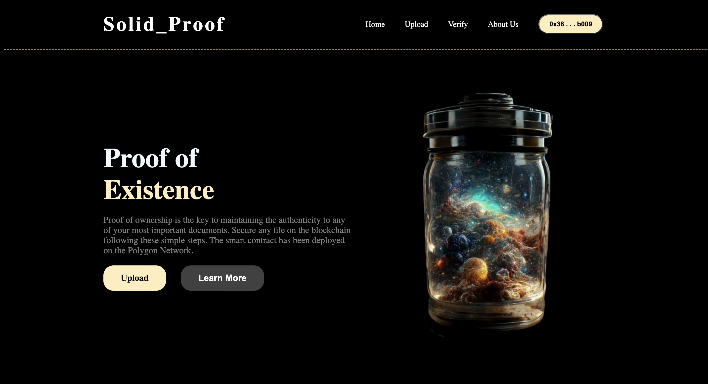
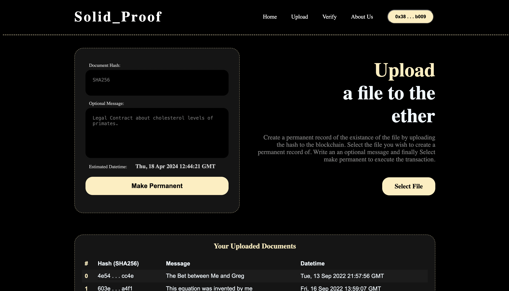
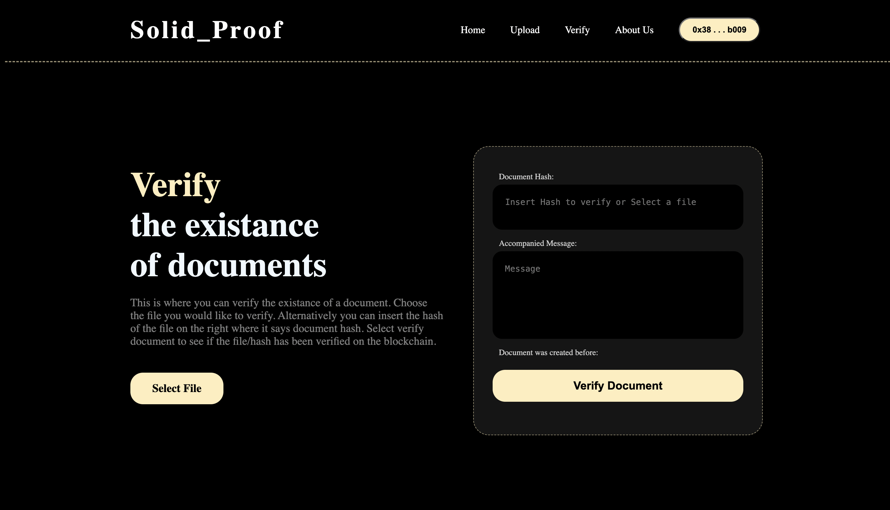

# Proof of Existence

Proof of Existence (PoE) is a concept and method used to verify the existence of certain data at a specific point in time using the blockchain. Essentially, it serves as a digital notary service.

1. **Document Hashing**: First, a digital file (such as a document, image, or any piece of digital information) is converted into a short, fixed-size string of bytes known as a hash. This hash function is designed to be a one-way process, ensuring that no one can deduce the original file from the hash. Each file will uniquely generate its own hash; even the slightest change in the file would result in a completely different hash.

2. **Recording on Blockchain**: The generated hash of the document is then recorded on a blockchain, a decentralized and tamper-proof digital ledger. Once recorded in a blockchain block, the data becomes immutable, meaning it cannot be changed without altering all subsequent blocks and the consensus of the network, which is practically unfeasible.

3. **Verification**: At any later point, the same document can be rehashed and compared to the stored hash on the blockchain. If the hashes match, it proves that the document existed in the exact form at the time the hash was recorded on the blockchain.

The benefits of Proof of Existence using blockchain include:

- **Integrity and Non-repudiation**: It ensures that the document has not been altered since its hash was recorded.
- **Decentralization**: Unlike traditional notary services, PoE does not rely on any central authority, making it more secure and less prone to manipulation or fraud.
- **Timestamping**: It provides a precise timestamp of when the document was recorded, which is useful for copyright, legal evidence, intellectual property rights, and more.

Proof of Existence is particularly useful in areas requiring verification and proof that certain information existed at a certain time without revealing the actual data itself, such as in legal, creative, and intellectual property domains.

# Tech Stack

- **Solidity**: Solidity EVM.
- **Truffle**: Development environment, testing framework, and asset pipeline for Ethereum.
- **Ganache**: Personal blockchain for Ethereum development.
- **Web3.js**: Ethereum JavaScript API.
- **Vue.js**: Progressive JavaScript framework for building user interfaces.
- **CSS Only**: No external CSS frameworks used.

The aim for this project was to familiarize myself with the Ethereum blockchain, smart contract development, and decentralized applications (dApps) while also refining my skills in Vue.js, Web Design and CSS.

# Screenshots

<!-- 50% width -->

