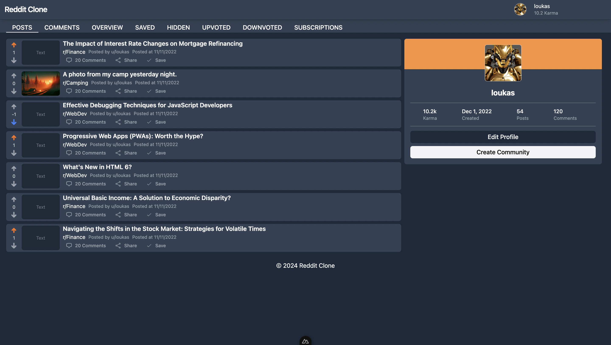

# Reddit Redesign and Implementation

## Description

This project is a redesign and implementation of the popular social media platform Reddit. The project is a full-stack web application that allows users to create subreddits, post text/image posts, comment on posts, and upvote/downvote posts and comments. The project also includes user authentication and user profiles.

The project is built using NuxtJS/TypeScript, a VueJS framework, and TailwindCSS for styling. The backend is built using Supabase, a Postgres database with a RESTful API.

## Features

- User Authentication
- User Registration
- User Profile
- Subreddits
- Text/image Posts
- Nested Comments
- Upvotes/Downvotes
- User Settings

## The Platform

### Home Page with a minimalistic design


### Subreddit Page


### Post Page with Nested Comments


### User Profile Page (Posts)



### User Profile Page (Comments)


### Subreddit Creation Page


### Post Creation Page for Subreddit (WebDev)


### Subreddit Page (Finance) 


## Installation

### NuxtJS

1. Clone the repository
2. Install dependencies
```bash
npm install
```
3. Run the development server
```bash
npm run dev
```

### Supabase

Execute the .sql files in the  `supabase` folder to create the tables and functions in the database.
